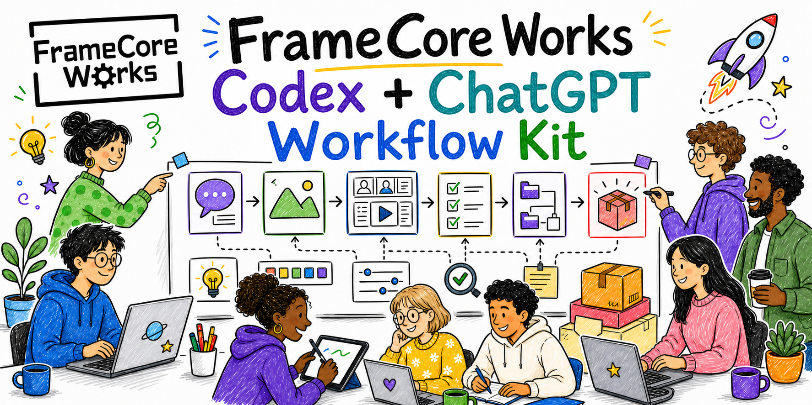

# FrameCore Works: Creative Workflow Skill Kit for Codex and ChatGPT

[](https://github.com/FrameCoreWorks/framecore-works-codex-chatgpt-workflow-kit/actions/workflows/validate.yml)
[](LICENSE)

Licensed under Apache-2.0. See [NOTICE](NOTICE) for redistribution notice details.

A creative workflow kit for Codex and ChatGPT Work: briefs, references, direction,
image and video prompts, QA and delivery. Static graphic design is integrated
into the existing skills, not installed as a separate asset.

## Install from this repository

Installation guidance is English. After verified installation, the workflow
adapts to your language without treating this page's copied prompts as your
language preference.

<a id="install-directly-from-the-repo-in-chatgpt"></a>

### ChatGPT Work

Your account and workspace must expose native Skills and `@skill-creator`.
Opening Work alone is not enough. Access depends on product availability and
workspace permissions; see [Skills in ChatGPT](https://help.openai.com/en/articles/20001066-skills-in-chatgpt).
If those capabilities are missing, use an eligible workspace or the Codex route below.

Open ChatGPT, switch the top selector from **Chat** to **Work**, and paste:

```text
Use @skill-creator to create and save selected native ChatGPT Skills from this public repository:
https://github.com/FrameCoreWorks/framecore-works-codex-chatgpt-workflow-kit

First read and follow CHATGPT_INSTALL.md, config/chatgpt-skills.json and
config/chatgpt-skill-sources.json. Follow the English onboarding, confirm my Workflow Profile and
the exact skill list, and let me choose guided or batch installation. Obtain the required
conversational approval before creation.

Read every declared source file for the selected skills. Use the actual native creation and save
workflow, keep each skill separate, and check the saved result. Do not create duplicates, substitute
a Codex installation, clone a workspace or run shell commands. If Skills, @skill-creator, source
access or saving are unavailable, stop and report the concrete blocker. A draft or approval is not a
completed installation.

Keep installation in English. Only after verified installation, resolve my working language from my
own conversation or explicit preference, not this copied English prompt. Explain how to use and
extend the installed skills. Do not activate providers, upload files or publish anything.
```

This creates the selected native skills, without a local clone or Codex agent
files. Full setup rules: [CHATGPT_INSTALL.md](CHATGPT_INSTALL.md). For profiles,
source files, approval modes and troubleshooting, see
[Native ChatGPT Skills](docs/chatgpt-skills-onboarding.md).

<a id="copy-paste-install-prompt"></a>

### Codex

This kit uses its own **project-local installer**, not the standalone
`$skill-installer` route. Open the project that should receive the workflow in
a shell-capable Codex workspace, then paste:

```text
Install FrameCore Works: Creative Workflow Skill Kit for Codex and ChatGPT into my current Codex
project:
https://github.com/FrameCoreWorks/framecore-works-codex-chatgpt-workflow-kit

First read CODEX_INSTALL.md from that repository. Confirm the actual host, shell access and
destination project. Keep installation guidance in English. Do not infer my language from this
pasted prompt.

Use the repository's project-local installer, not a standalone Skill installer. Obtain a clean
current-main checkout outside my project, verify its origin, record its full commit ID, and read its
instructions. If this project already has .framecore/manifest.json, stop the fresh-install path and
follow CODEX_UPDATE.md instead.

Run repository checks, doctor/preflight, English preference onboarding and dry-run. Show the
destination, managed files and conflicts, then obtain my approval before installation. Preserve my
existing AGENTS.md and unrelated files. Never use --force, global install, providers, API keys or
uploads without separate explicit approval.

After installation, verify the manifest and actual installed files. Only then resolve my working
language from an explicit preference or my own conversation text, excluding pasted setup prompts;
use a reliably exposed host locale only as a fallback, otherwise English. Explain the installed
workflow and give me one useful starter prompt in that language. If host activation requires
reopening the project or a new conversation, say so without claiming a reload you did not observe.
```

Codex keeps the source checkout outside your project and installs the managed
skills, role agents and project instructions into the selected project. It does
not install a separate Static Graphic Design Creator skill.

For manual commands, use [CODEX_INSTALL.md](CODEX_INSTALL.md). For a first setup,
see [Quickstart](docs/quickstart.md) or [Codex-assisted install](docs/codex-assisted-install.md).
If shell access or Git is unavailable, stop: nothing was installed.
[GitHub Desktop](https://desktop.github.com/) is an optional visual cloning tool,
not an installer.

## Update an existing installation

Updates start with a read-only comparison and need approval before replacement.
They preserve the existing installation and personal changes; they do not run
in the background or create a second copy.

<a id="update-native-chatgpt-skills"></a>

### ChatGPT Work update

In Work with the existing native skills and `@skill-creator` available, paste:

```text
Use @skill-creator to update my existing native ChatGPT Skills from:
https://github.com/FrameCoreWorks/framecore-works-codex-chatgpt-workflow-kit

First read CHATGPT_UPDATE.md. Identify the actual installed Skills, their source evidence and the
active host's supported editing and readback capabilities. Update the existing entries only; do not
create duplicate Skills or substitute a Codex installation.

Resolve the latest main commit once and pin all configuration, source inventory and source reads to
that same full commit. Compare the previous verified source when available, the new source and the
actual installed content. Report the target commit, changed/new/removed/already-current files,
personal edits, conflicts and verification limits. Do not infer exact upstream identity from names
or package version.

Prepare a complete conflict-safe proposal read-only. Preserve personal additions and unrelated
behavior. If there is no upstream change, report already_up_to_date or
local_customizations_preserved without saving. Otherwise show the exact Delta and obtain my approval
before editing any saved Skill.

After approval, use the actual native editing workflow for the same entries, then read back and
verify the intended content and preserved resources. Approval, a local draft or an already visible
library entry alone is not proof of a successful update. If a save response fails or is lost,
inspect actual saved state before considering another attempt; do not retry or roll back blindly.

Explain results in my resolved working language because the Skills are already installed, but keep
public source descriptions in English. Do not use shell commands, global installs, providers,
uploads, publishing or background updates.
```

The existing native entries are updated through the supported save workflow.
Source comparison, recovery and readback rules: [CHATGPT_UPDATE.md](CHATGPT_UPDATE.md).

<a id="update-an-existing-workspace"></a>

### Codex update

Open the project where the kit is already installed, then paste:

```text
Update my existing project-local FrameCore workflow to the latest main commit from:
https://github.com/FrameCoreWorks/framecore-works-codex-chatgpt-workflow-kit

First read CODEX_UPDATE.md. Find my current project's .framecore/manifest.json and confirm the
actual host and destination. This is an update, not a fresh or global install.

Find the kit checkout outside my project. Verify its origin and Git status. Fetch origin/main and
use a clean checkout at that exact full commit; do not reset, discard, stash or overwrite anyone's
uncommitted work. If the checkout is dirty or diverged, stop or propose a separate clean source
checkout outside my project. Report the previous known source identity and the fetched target
commit; do not infer a precise source commit from package version alone.

Run release checks, doctor in update mode and install dry-run. Compare actual installed files with
manifest hashes and available old source evidence. Show changed, new, retired and unchanged files,
local modifications and any conflicts. Preserve personal additions. The built-in updater does not
perform a three-way merge: do not describe backups or --force as a conflict-safe merge.

Ask for approval of the concrete update. If local modifications conflict, prepare the exact proposed
resolution read-only and stop before writes until I approve it. Do not use --force just to make the
command succeed.

Apply the approved update to this same project. Verify doctor, managed hashes, preserved local files
and the final manifest, then repeat dry-run to check for remaining changes. Report the source
commit, changes, backup locations and verification. Use my resolved working language only because
this is an already installed environment. Do not upload, publish, activate providers or change
global installations.
```

Refreshing the source checkout and updating installed files are separate steps.
The CLI does not fetch GitHub, and `--force` does not merge personal edits.
Commands and recovery rules: [CODEX_UPDATE.md](CODEX_UPDATE.md).

<a id="extend-your-installed-skills"></a>

## Extend your own installed skills

Use this when you want an existing skill to fit your work better: add examples,
formats, references, decision rules or QA checks. This is a **personal extension**,
not an upstream update or a new skill. The assistant first asks what should
change, prepares a proposal and waits for approval.

Replace `<skill-name>` with one installed skill, such as
`image-prompt-architect`. The kit has no automatic extension-folder convention;
supporting resources must be explicitly loaded by that skill. Personal overrides
remain visible during later updates. See [Skill customization](docs/skill-customization.md).

### ChatGPT Work personal extension

In a Work conversation with the existing skill and `@skill-creator` available, paste:

```text
Use @skill-creator to help me extend my existing native FrameCore Skill: <skill-name>.

This is a guided personal extension, not a fresh install, upstream update or public repository edit.
Identify the existing native entry and use this host's actual edit/save workflow. Do not create a
duplicate or substitute a Codex filesystem installation. Resolve my working language from my
explicit preference and own conversation because this Skill is already installed.

Inspect the current Skill and its accessible resources. Ask what I want to add, change or
specialize, then request only the necessary examples and constraints. Prepare a read-only Change
Proposal: objective, exact scope, preserved behavior, expected benefit, conflicts, acceptance test,
rollback and stop condition. Wait for my approval before any saved change.

Preserve a recoverable baseline using a supported private mechanism. Apply only the approved
extension, keep the upstream source identity unchanged and preserve unrelated behavior. A supporting
file must be explicitly loaded by the Skill; do not invent automatic extension-folder support.

Verify the actual saved identity, complete intended content and preserved resources. A draft,
approval or existing library entry is not proof of persistence. If saving fails or the response is
lost, inspect actual saved state first. Do not blindly retry, roll back, force-push or switch save
services. Report preparation, persistence and verification separately, and stop if reliable readback
is unavailable. Do not publish personal files, upload assets, activate providers or run background
updates.
```

### Codex personal extension

Open the installed project in Codex with `$skill-creator` available, then paste:

```text
Use $skill-creator to help me extend my existing installed FrameCore Skill: <skill-name>.

This is a guided personal extension, not a fresh install, upstream update or public repository edit.
Locate the exact existing Skill and confirm its installation scope. Do not create a duplicate or
clone another repository into my project. Resolve my working language from my explicit preference
and own conversation because this Skill is already installed.

First inspect its current instructions, relevant resources and managed-file status. Ask what I want
to add, change or specialize, and request only the real examples or constraints needed to define the
change.

Before writing, propose the objective, exact files, preserved behavior, expected benefit, conflicts,
acceptance test, rollback and stop condition. Prepare exact changes read-only and wait for my
approval.

Prefer supporting resources inside the existing Skill when appropriate. Do not assume that
local/SKILL_EXTENSIONS.md or any other filename is automatically loaded: include the smallest
explicit loading instruction in the approved change when needed. Explain that editing kit-managed
files is a personal override that can block a later upstream update.

After approval, preserve a recoverable snapshot, apply only the agreed changes, validate the
complete resulting Skill and read back the saved bytes. Preserve unrelated files and the upstream
source identity. Do not change manifest hashes merely to hide local drift. Report what changed, how
to test it and how to undo it. Do not publish, upload, use providers or modify global configuration.
```

## What This Repo Gives You

This skill kit adds a project-local creative workflow layer to Codex and exposes the same public skill contracts as repository-source native ChatGPT Skills. It does not install paid providers or API-key tooling. It gives the active surface a structured way to move work from request intake to brief, references, direction, prompts, QA, and delivery notes. Codex additionally supports local agents, manifests, and long-session recovery files.

## Human-In-The-Loop Boundary

This is a human-in-the-loop workflow kit, not an autonomous agent system. It
helps a user and the active Codex or ChatGPT surface structure work through
skills, temporary or local role responsibilities, gates, artifacts, and QA.

The user remains responsible for the goal, facts, source materials,
permissions, approvals, and final decisions. Role-agent templates and skills
guide model behavior; they are not background workers, a task queue, or a
guarantee that every workflow step was followed. Local tooling can enforce
install, manifest, path, schema, fixture, and package-safety rules, but it
cannot certify the quality of a model response or silently complete work.

The kit does not start hidden background work, autonomously execute a workflow,
or claim that an unverified step has been completed. Where evidence matters,
the workflow records artifacts, QA results, caveats, and the user-visible stop
decision.

At a glance, the repo includes:

- **20 Codex role-agent templates** for routing, creative planning, prompting, QA, delivery, and execution documentation.
- **35 portable workflow skills** for brief building, research evidence, copy and voice, ecommerce strategy, screenplay development, creative video production, captions, OpenCut and Remotion production, safe tool-routing and cost planning, image and video prompting, storyboard work, Humanizer, integrated HyperFrames planning, Hipson-style packets, QA, delivery, onboarding, and workflow self-improvement. Every skill includes native UI metadata and a public source mapping for creation through the active `@skill-creator` workflow.
- **Project-local install and onboarding** with doctor/preflight, dry-run, manifest tracking, update, repair, and uninstall.
- **Workflow contracts** for gates, handoffs, artifact schemas, examples, Loop Protocol, and provider-neutral safety boundaries.

For the full inventory, see [Included Agents And Skills](docs/included-agents-and-skills.md). For iterative QA and repair discipline, see [Loop Protocol](docs/loop-protocol.md). For ready-to-use copy, voice, captions, and editorial delivery rules, see [Human Voice And Copy Delivery](docs/human-voice-and-copy-delivery.md). For the staged adoption plan, see [Loop Protocol Integration Plan](docs/loop-protocol-integration-plan.md).

| Area | Included examples |
| --- | --- |
| Core routing | `intent-confirmation`, `workflow-orchestrator`, `instruction-packet-factory`, `pipeline-core` |
| Creative planning | `brief-architect`, `reference-curator`, `ecommerce-campaign-strategy-director`, `screenplay-story-architect`, campaign and storytelling skills |
| Video production | `creative-video-producer`, `producer-ai-task-builder`, `caption-studio`, `opencut-video-studio`, `remotion-video-production`, storyboard and HyperFrames skills |
| Prompt production | `image-prompting`, `video-prompting`, `image-prompt-architect`, `video-prompt-architect` |
| QA and delivery | `qa-iteration`, `asset-manifest`, `delivery-documentation`, output critique and delivery skills |
| Long-session support | `Context/`, `Memory Cache/`, Project State templates, semantic-memory helpers |
| Specialized workflow knowledge | Humanizer, ecommerce strategy, screenplay development, captions, OpenCut planning, Remotion production, HyperFrames, lightweight Hipson Adapter, storyboard board planning |

The kit provides the workflow spine: roles, gates, handoffs, artifact expectations, examples, safety boundaries, onboarding, and update/repair lifecycle. Users can layer deeper domain-specific prompting or execution tools on top, but those provider/tool integrations are intentionally not bundled here.

[Static graphic design](docs/static-graphic-design.md) is integrated into the
existing direction, copy, reference, image-prompting, QA and asset-manifest
skills. It adds objective-first concepts, composition and typography guidance,
an optional 200-code poster catalog, one-pass prompt construction and bounded
repair/DTP handoffs. There is no separate Static Graphic Design Creator skill
or installation; the inventory remains 35 skills.

### How Skills Start After Install

On both supported surfaces, ordinary natural-language requests can route to eligible installed skills. Routing should stay proportional to the task:

- a request for one image prompt, video prompt, brief, storyboard, caption plan, or review uses the smallest relevant specialist route;
- an end-to-end campaign, production pack, or other genuinely multi-stage task can activate orchestration, dependent skills, gates, handoffs, and QA;
- the `workflow-orchestrator` skill explicitly asks for route selection and visible state;
- the `pipeline-core` skill explicitly asks for governed multi-stage routing, while still skipping irrelevant stages.

ChatGPT ultimately controls native implicit invocation, so exact natural-language routing can vary with the active product surface. In ChatGPT Work, use `@workflow-orchestrator` or `@pipeline-core` when route predictability matters. In Codex, use `$workflow-orchestrator` or `$pipeline-core`. Onboarding, the optional Hipson Adapter, and workflow self-improvement remain explicit-only and do not start from unrelated requests.

Installed ChatGPT Skills remain editable. In Work, use `@skill-creator` and ask it to change a named skill, add examples, refine its output format, or strengthen its QA checks. To create a new personal skill, start with:

```text
Use @skill-creator to help me create a skill.
```

## Supported Agent Surfaces

| Surface | What works | Notes |
| --- | --- | --- |
| OpenAI Codex CLI with custom-agent support | Full project-local install, `AGENTS.md`, skills, rendered `.codex/agents/*.toml`, guided install, doctor, update, repair, uninstall | Recommended full experience. |
| OpenAI Codex or ChatGPT environments that read project instructions but do not expose custom-agent spawning | `AGENTS.md`, installed skills, workflow docs, examples, artifact contracts | `.codex/agents/*.toml` may be inert, but the workflow contracts remain useful. |
| Native ChatGPT Skills | Repository-source skill creation, UI metadata, guided onboarding, reusable workflow instructions, and temporary task roles | Requires native Skills, ChatGPT Work, `@skill-creator`, public GitHub source access, conversational approval in batch or guided mode, and a real creation result for each selected skill. |
| Other AGENTS-aware coding agents or editors | `AGENTS.md`, docs, examples, and reusable skill files when read manually | Custom-agent `.toml` files are Codex-specific and may not be consumed. |
| Chat-only environments without native Skills | Documentation and manual guidance only | Use a ChatGPT account with native Skills, or use a local terminal or shell-capable Codex workspace. |

## Execution Boundary

| Path | Included in this repo | What it does |
| --- | --- | --- |
| Prompt-only workflow | Yes | Produces briefs, reference packs, direction, prompt packs, QA criteria, and delivery notes. |
| Built-in Codex/ChatGPT image generation for generated static raster graphics | Policy only | Default route when available and explicitly requested by the user; visible text is generated in one pass. |
| External paid media-provider execution | No | Users may add their own tools outside this public kit. |
| Full Hipson | No | The included Hipson Adapter is lightweight; full Hipson remains separate and optional. |

## What This Repo Does Not Do

- It does not install paid media providers, API keys, provider CLIs, or external execution tools.
- It does not upload files, publish outputs, or send work to cloud folders by default.
- It does not make the ChatGPT Chat surface behave like a shell-capable Codex workspace or the native Skill creation surface. Use ChatGPT Work with `@skill-creator` for native Skills.
- It does not automatically generate PDFs, videos, images, or final delivery packages without a clear user request and an available execution surface.
- It does not install full Hipson; it includes only a lightweight adapter for bounded packets and handoffs.
- It does not overwrite user-owned files unless the user intentionally approves a force path.

## Mental Model

Skills are workflow contracts, not personality presets. A skill defines when a workflow role should act, what input it needs, what artifact it must produce, which QA gate applies, and where the handoff goes next.

Onboarding does not rewrite that workflow logic. In Codex it tunes local workspace preferences. In ChatGPT it creates a visible neutral Workflow Profile, temporary role rules, safety boundaries, and a reusable starter prompt.

## Start Here

- First installation: read [Getting Started In 5 Minutes](docs/getting-started-5-minutes.md).
- New to the kit: read [Quickstart](docs/quickstart.md).
- Installing by pasting a GitHub link into Codex: read [Codex-Assisted Install](docs/codex-assisted-install.md).
- Using native ChatGPT Skills instead of Codex: read [Native ChatGPT Skills](docs/chatgpt-skills-onboarding.md).
- Already installed and ready to work: read [Using The Kit](docs/using-the-kit.md).
- Already installed and want the newest repo changes: use [Update An Existing Workspace](#codex-update).
- Installation failed or produced an unexpected result: read [Troubleshooting](docs/troubleshooting.md).
- Need quick answers first: read [FAQ](docs/faq.md).
- Want to see exactly what is included: read [Included Agents And Skills](docs/included-agents-and-skills.md).
- Want to see how workflow pieces fit together: read [Workflow Map](docs/workflow-map.md).
- Sending test results or a bug report: use [Tester Feedback Guide](docs/tester-feedback.md).
- Checking supported environments and install modes: read [Compatibility](docs/compatibility.md).
- Want command behavior and safety boundaries: read [CLI Reference](docs/cli-reference.md).
- Want the mental model first: read [Architecture](docs/architecture.md).
- Running long Codex sessions or handoffs: read [Memory Cache](docs/memory-cache.md) and [Context Folder](docs/context-folder.md).
- Using local semantic lookup: read [Semantic Memory](docs/semantic-memory.md).
- Need the local OpenAI API boundary: read [OpenAI API Policy](docs/openai-api-policy.md).
- Want to understand current limits and planned direction: read [Roadmap](docs/roadmap.md).
- Want the future plugin or bundle direction: read [Bundle Readiness](docs/bundle-readiness.md).
- Preparing for a stable public release: read [v1.0 Readiness](docs/v1-readiness.md).
- Verifying behavior in a real Codex workspace before broad promotion: read [Live Codex E2E Check](docs/live-codex-e2e-check.md).
- Recording reviewed live Codex evidence: use [E2E Results](docs/e2e-results/README.md) and [E2E Result Template](docs/e2e-results/TEMPLATE.md).
- Checking what provider-neutral allows and forbids: read [Provider-Neutral Boundary](docs/provider-neutral-boundary.md).
- Want to compare workflow paths: open [Examples Index](examples/README.md).
- Using the kit with a team: read [Team Configuration](docs/team-configuration.md).
- Want to see a complete workflow specimen: open [End-To-End Creative Workflow Example](examples/end-to-end-creative-workflow/README.md).
- Maintaining example routes: use each example's checked `workflow.json`.
- Adding or maintaining public examples: read [Example Authoring](docs/example-authoring.md).
- Maintaining artifact contracts: read [Artifact Schemas](docs/artifact-schemas.md).
- Preparing a release or repo maintenance change: read [Release Guide](docs/release.md).
- Migrating reusable workflow logic from another setup: read [Migration Guide](docs/migration-guide.md).
- Configuring GitHub protections for this public repo: read [Repository Settings](docs/repository-settings.md).
- Already installing: use the short install flow below.

## What It Installs

- Role-based Codex agent templates with local display-name customization.
- Workflow skills for intake, references, research, direction, copy, prompts, QA, delivery, and retrospectives.
- Humanizer for natural copy polish and voice consistency.
- HyperFrames workflow knowledge for coded video planning, scene structure, animation guidance, caption planning, render QA, and delivery manifests.
- Hipson Adapter for research maps, internet mapping packets, bounded instruction packets, review packets, and execution packets.
- Project State templates for durable run-state, context recovery, blockers, touched files, and next-action handoff.
- Memory Cache templates and local tools for long-session recovery, context-budget checks, semantic lookup, and report-only self-improvement queues.

Project-local install writes only exact FrameCore-managed files:

- `.agents/skills/<framecore-skill>/...`
- `.codex/agents/<role-id>.toml`
- `AGENTS.md` when no project `AGENTS.md` exists yet
- `AGENTS.framecore.md` when the project already has its own `AGENTS.md`
- `.framecore/manifest.json`

The repo also includes validation and privacy audit scripts for checking this kit before installation or contribution. The audit rejects private names, excluded provider remnants, local machine paths, emails, secret files, secret-like values, private cloud links/IDs, symlinks, and AppleDouble metadata files.

## Privacy And Scope

This kit contains reusable workflow assets: role-based agents, skills, templates, onboarding, validation, and project-local configuration.

Public documentation, source instructions, metadata and installation prompts are English. Only after verified installation does the host resolve the user's working language: explicit preference, then user-authored conversation, then reliably exposed locale, otherwise English. Copied English setup prompts do not set the user's language. Do not infer hidden account settings. Deliverable-language requests and exact artwork copy remain separate. The CLI stays English; the installed conversational workflow adapts without translating public source files.

## Install Flow

For the beginner-safe guided path, run:

```bash
npm run install:guided -- --target /path/to/your/project
```

For a non-interactive default setup in an existing target workspace:

```bash
npm run install:guided -- --target /path/to/your/project --defaults --yes
```

The guided installer refuses missing targets, runs repository checks, runs doctor/preflight, runs onboarding, performs a post-onboarding dry-run, asks before the final install unless `--yes` is used, and installs project-local only.

To verify the golden install path in a temporary target without touching a real project:

```bash
npm run smoke:install
```

The smoke check runs default onboarding, guided project-local install, expected file checks, manifest hash checks, doctor/preflight, and uninstall preview.

Manual fallback:

1. Clone or download this repo.
2. Check the repository:

   ```bash
   npm run check
   ```

3. Run preflight:

   ```bash
   npm run doctor -- --target /path/to/your/project
   ```

4. Review the preflight result. The installer refuses to overwrite user-owned files by default.

5. Run onboarding:

   ```bash
   node scripts/onboard.mjs --target /path/to/your/project
   ```

6. Run dry run after onboarding so rendered agents use the final local config:

   ```bash
   npm run install:dry-run -- --target /path/to/your/project
   ```

7. Install project-local:

   ```bash
   node scripts/install.mjs --mode project-local --target /path/to/your/project
   ```

If your project already has `AGENTS.md`, the installer writes `AGENTS.framecore.md` instead. Use `--force` only when you intentionally want FrameCore to overwrite a conflicting user-owned file.

Global install is available only for advanced users. It writes to the current user's home workspace, so preview it first:

```bash
npm run doctor -- --mode global
node scripts/install.mjs --mode dry-run --target "$HOME"
```

Apply global install only when that is intentional:

```bash
node scripts/install.mjs --mode global --confirm-global
```

Use `--mode dry-run` first for every install target.

## Update, Repair, And Uninstall

Update requires an existing `.framecore/manifest.json`, upgrades the current FrameCore-managed set, and refuses user-owned conflicts. It also refuses locally edited managed files when their manifest hashes changed; rerun with `--force` only when you intentionally want to overwrite those local edits after creating backups:

```bash
node scripts/install.mjs --mode update --target /path/to/your/project
```

Repair also requires a manifest, but rewrites only paths already recorded in that manifest. It does not add new managed paths, and it applies the same local-edit hash protection as update:

```bash
node scripts/install.mjs --mode repair --target /path/to/your/project
```

Before update or repair overwrites changed managed files or rewrites a changed manifest, it creates numbered `.bak` backups such as `AGENTS.md.bak` or `.framecore/manifest.json.bak`. If a managed file is already byte-identical to the kit output, update leaves it untouched and does not create a backup.

Uninstall previews removals by default:

```bash
node scripts/install.mjs --mode uninstall --target /path/to/your/project
```

Apply uninstall with:

```bash
node scripts/install.mjs --mode uninstall --target /path/to/your/project --yes
```

Uninstall removes only exact files recorded in the manifest. It refuses directory removals and unsafe paths.

Backup files are not added to the manifest and are preserved for manual review or removal.

## First-Run Onboarding

Onboarding collects:

- response tone
- local display names for role-based agents
- output folder
- QA strictness
- optional recurring workflow self-improvement review
- optional full Hipson expansion

Agent source files in this repo use neutral role IDs only. User-specific display names are generated locally and should not be committed.

`framecore.config.json` is validated before rendering or installation. Invalid config values stop installation before managed files are written. Teams can add an optional `framecore.config.shared.json` for reviewed shared defaults; local `framecore.config.json` still takes precedence.

## Static Raster And Text-Bearing Image Policy

Generated static raster graphics should use the built-in Codex/ChatGPT image generation capability powered by GPT Image 2 by default when available. This includes posters, social graphics, banners, infographics, thumbnails, ecommerce graphics, storyboard boards, and similar bitmap visuals.

Static raster graphics with visible text must use the same built-in path in one pass, with all visible text included directly in the generated image.

This is a native chat-window generation path, not an external provider integration, API key requirement, CLI, or paid media-provider workflow. The workflow must not replace requested graphic generation with Python-generated artwork, SVG, HTML/canvas, Sharp/composited PNG, or other coded artwork unless the user explicitly asks for a coded, vector, template, or editable source artifact. It also must not generate a text-free background first and add typography later with overlays, compositing, design tools, or manual editing unless the user explicitly asks for a coded or vector artifact.

## Hipson Adapter

This repo includes only the lightweight Hipson Adapter. It works inside this architecture as a packet factory for:

- research maps
- internet mapping packets
- bounded instruction packets
- review packets
- execution packets

The full Hipson system is an optional external extension maintained separately at:

https://github.com/Hipson47/Hipson.git

Onboarding explains the current adapter scope and lets the user record whether they intend to connect the full Hipson system later. It does not clone, install, or activate full Hipson during kit setup.

## Workflow Self-Improvement

The `workflow-self-improvement` skill is explicit-only. It creates retrospective notes and change proposals. It does not run as a hidden daemon, edit instructions automatically, upload files, run external tools, or perform destructive operations.

Onboarding can optionally create a report-only 24-hour review recipe. The default is disabled.

The local `self:audit` and `self:improve:local` commands write proposal queues into a valid `Memory Cache/`. They do not patch source files.

## Long Session Recovery

For long-running projects, create an operational folder with separate `Context/` and `Memory Cache/` folders:

```bash
npm run memory:init -- --target /path/to/operational-folder --create-target
npm run memory:validate -- --target /path/to/operational-folder
```

`Context/` is for user-supplied briefs, references, attachments, and source data. `Memory Cache/` is for durable recovery state, checkpoint IDs, safe resume notes, decision logs, source maps, and artifact indexes. The tools do not repopulate `Context/` from `Memory Cache/`.

Local semantic memory works without API access:

```bash
npm run semantic:index -- --target /path/to/operational-folder
npm run semantic:query -- --target /path/to/operational-folder --query "recovery prompt"
```

OpenAI API paths require the exact activation phrase `openai api active`. Without that phrase, API-gated commands stop before any API-capable work.

## Development

This is a GitHub-first repo. `package.json` provides local scripts, package metadata, and packaging checks; npm publication is optional and not required for project-local installation.

```bash
npm run audit:privacy
npm run secret:scan
npm run syntax:check
npm run validate
npm run agent:check
npm test
npm run check
npm run smoke:install
npm run release:check
npm run package:list
npm run memory:validate -- --target /path/to/operational-folder
npm run workflow:context-budget -- --target /path/to/operational-folder
node scripts/doctor.mjs --help
node scripts/install.mjs --help
```

`npm run check` is the expected CI path. It runs the privacy audit, dependency-free secret scan, syntax check, workflow validation, deterministic agent compliance, and tests. `npm run release:check` adds the install smoke test, package audit, and release-readiness gate.

See also:

- [Quickstart](docs/quickstart.md)
- [Codex-Assisted Install](docs/codex-assisted-install.md)
- [Using The Kit](docs/using-the-kit.md)
- [Troubleshooting](docs/troubleshooting.md)
- [FAQ](docs/faq.md)
- [Compatibility](docs/compatibility.md)
- [CLI Reference](docs/cli-reference.md)
- [Included Agents And Skills](docs/included-agents-and-skills.md)
- [Workflow Map](docs/workflow-map.md)
- [Provider-Neutral Boundary](docs/provider-neutral-boundary.md)
- [Memory Cache](docs/memory-cache.md)
- [Context Folder](docs/context-folder.md)
- [Semantic Memory](docs/semantic-memory.md)
- [Self-Improvement Tools](docs/self-improvement.md)
- [OpenAI API Policy](docs/openai-api-policy.md)
- [v1.0 Readiness](docs/v1-readiness.md)
- [Release Guide](docs/release.md)
- [Release Notes Template](docs/release-notes-template.md)
- [Roadmap](docs/roadmap.md)
- [Architecture](docs/architecture.md)
- [Artifact Schemas](docs/artifact-schemas.md)
- [Creative Prompting Workflow](docs/creative-prompting-workflow.md)
- [Human Voice And Copy Delivery](docs/human-voice-and-copy-delivery.md)
- [Example Authoring](docs/example-authoring.md)
- [Workflow Stages](docs/workflow-stages.md)
- [Onboarding](docs/onboarding.md)
- [Customization](docs/customization.md)
- [Team Configuration](docs/team-configuration.md)
- [Text-Bearing Image Policy](docs/text-image-policy.md)
- [Hipson Integration](docs/hipson-integration.md)
- [HyperFrames](docs/hyperframes.md)
- [Recurring Workflow Review](docs/recurring-workflow-review.md)
- [Workflow Self-Improvement](docs/workflow-self-improvement.md)
- [Migration Guide](docs/migration-guide.md)
- [Agent Roster](docs/agent-roster.md)
- [Repository Settings](docs/repository-settings.md)
- [Examples Index](examples/README.md)
- [End-To-End Creative Workflow Example](examples/end-to-end-creative-workflow/README.md)
- [Minimal Workflow Example](examples/minimal-workflow/README.md)
- [Static Campaign Example](examples/static-campaign/README.md)
- [Ecommerce Product Visual Example](examples/ecommerce-product-visual/README.md)
- [Video Storyboard Example](examples/video-storyboard/README.md)
- [Storyboard Board Example](examples/storyboard-board/README.md)
- [HyperFrames Video Example](examples/hyperframes-video/README.md)
- [Image Prompt Pack Example](examples/image-prompt-pack/README.md)
- [Document Workflow Example](examples/document-workflow/README.md)
- [Hipson Adapter Packets Example](examples/hipson-adapter-packets/README.md)
- [QA And Delivery Review Example](examples/qa-delivery-review/README.md)
- [No External Execution Mode Example](examples/no-provider-mode/README.md)
- [Contributing](CONTRIBUTING.md)
- [Security](SECURITY.md)
- [Support](SUPPORT.md)
- [Maintainers](MAINTAINERS.md)
- [Code of Conduct](CODE_OF_CONDUCT.md)

## About the Project

This kit ships the routing and contract layer for creative work and was created by FrameCore Works.
To support its development, visit https://buycoffee.to/framecoreworks.
