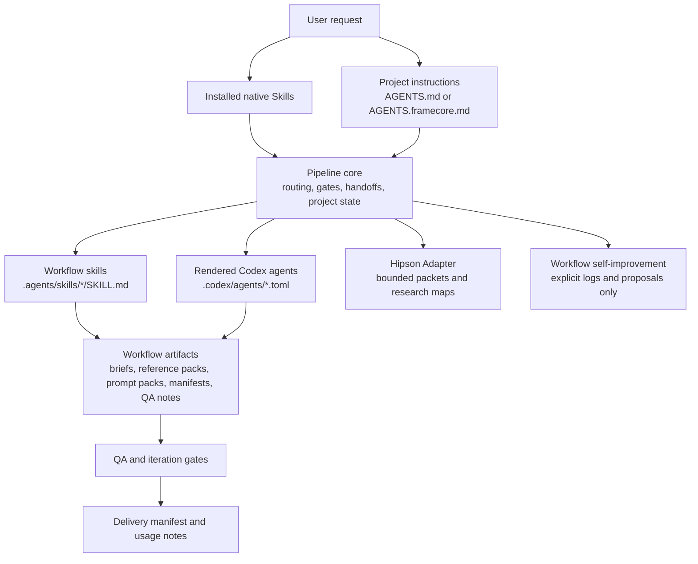

# Architecture

This provider-neutral workflow layer supports native Codex Skills through
`$skill-installer` and native ChatGPT Skills through `@skill-creator`. Both reuse
the same portable Skill bundles and role contracts. Codex additionally offers an
optional advanced project-local installer with agent files, config and a manifest.

## Human-In-The-Loop Boundary

The kit governs collaboration between a user and an active Codex or ChatGPT
surface. It is not an autonomous agent runtime: role-agent templates and skills
are instructions and contracts, not background workers, a task queue, or a
guarantee of model compliance.

The user owns goals, facts, permissions, approvals, and final decisions. Local
tools enforce selected filesystem, manifest, schema, fixture, and package
checks. They cannot certify creative quality, prove that a model followed every
instruction, or complete unrequested work in the background. Artifacts, QA
notes, caveats, and stop decisions are the evidence for work that was actually
reviewed.

## System Layers

Native Skill entry points route directly to the workflow contracts below.
The project instructions and rendered-agent branches are optional and appear
only in the advanced project mode.

## Layer Responsibilities

- Pipeline core: role routing, review gates, handoffs, project state, Creative Prompt Contracts, artifact templates, and artifact schema validation.
- Production skills: brief, reference, research, direction, copy, prompt, QA, delivery, Humanizer, and HyperFrames workflow knowledge.
- Expansion layer: lightweight Hipson Adapter for research maps, internet mapping packets, bounded instruction packets, review packets, and execution packets.
- Governance layer: explicit workflow self-improvement logs and change proposals. It is report-only unless the user asks for a specific change.

## Skill Contract Model

Each `SKILL.md` is an operational contract. It tells Codex or ChatGPT:

- when the skill should trigger;
- what inputs are required or optional;
- what artifact or decision it must produce;
- what process and decision rules apply;
- what guardrails must not be crossed;
- which review gate applies;
- what handoff fields the next role needs.

The contract keeps runtime behavior predictable without turning each skill into a long manual. Detailed examples and domain references belong in `references/`, `templates/`, or `examples/` when they are too large for the skill body.

[Static graphic design](static-graphic-design.md) follows this model: its domain
references, optional Node checks and templates live inside existing specialist
skills. It reuses their roles, gates and artifacts rather than introducing a
standalone skill, installer, provider runtime or orchestration layer.

Artifact contracts are tracked separately in `config/artifact-schemas.json`. Validation checks that gate-required artifacts, template sections, and registered example fixtures keep the same required fields.

For image, edit, and video work with strict controls, the pipeline can also use a
Creative Prompt Contract. It is a revisioned planning artifact that binds prompt
intent to reference roles, per-request attachments, text layout, edit
preservation, shot requirements, continuity carriers, target verification, and
QA observables. It is reviewed through existing prompt and QA gates; it does not
create a new provider integration or execution permission.

Example routes are tracked in `examples/*/workflow.json`. Validation checks that each example uses known role IDs, known gates, known artifacts, and handoffs that exist in the handoff matrix.

## Installation Model

The primary Codex route uses the system `$skill-installer` with a pinned commit
and approved `.agents/skills/<skill-name>` source directories. It writes only
personal Skills in `$CODEX_HOME/skills`; it does not install the project CLI,
agent TOMLs, AGENTS files, config or `.framecore/manifest.json`. A private receipt
outside the bundles records verified source and saved digests. Native updates
use `$skill-creator` and [CODEX_UPDATE.md](../CODEX_UPDATE.md), not the CLI.

Reuse `profiles` from `config/chatgpt-skills.json` and the existing Skill source
inventory for selection and integrity, not the ChatGPT-specific creation rules.
Roles are bounded task responsibilities unless the current Codex host actually
exposes agents. No permanent agent registration is implied by native installation.

The remaining installation model describes the optional project-local CLI.

Project-local install copies only FrameCore-managed files into the target workspace:

- `.agents/skills/<framecore-skill>/...`
- `.codex/agents/<role-id>.toml`
- `AGENTS.md` when no project `AGENTS.md` exists yet
- `AGENTS.framecore.md` when the project already has its own `AGENTS.md`
- `.framecore/manifest.json`

Onboarding writes `framecore.config.json` before installation. The installer reads that file when rendering local agent display names, language, tone, output folder, and QA preference into `.codex/agents/*.toml`. If a team provides `framecore.config.shared.json`, the effective config is built from built-in defaults, shared config, and then local config, with local values taking precedence.

## Native ChatGPT Repository Model

`CHATGPT_INSTALL.md` defines the English installation and post-install language detection, batch or guided conversational approval, native creation, and post-install customization contract. `config/chatgpt-skills.json` declares the repository identity, core, creative, and full profiles, installation modes, installation order, and completion rules. `config/chatgpt-skill-sources.json` maps every selected skill to its exact public source files, raw GitHub URLs, and SHA-256 hashes.

`scripts/chatgpt-skill-sources.mjs` regenerates and validates that mapping after source changes. The user switches ChatGPT from Chat to Work and pastes the README prompt with an explicit `@skill-creator` mention. ChatGPT then reads only the selected skill sources and creates each native skill through Create with chat. The `@` mention is a native Skill invocation, not a `$skill-creator` command, function tool, or MCP tool. Codex agent templates, AGENTS files, local manifests, Context, Memory Cache, private paths, and generated workspace state remain outside this route. ChatGPT uses role IDs as temporary responsibilities inside the current task; it does not consume `.codex/agents/*.toml` as persistent agents.

## Ownership And Safety

For an advanced project installation, the manifest is the source of truth for
FrameCore-owned files in that target workspace. Native personal Skills are not
owned by a project manifest. Repair and uninstall use `.framecore/manifest.json` to avoid touching user-owned files. New manifests also include managed file hashes so `doctor` can warn when a FrameCore-managed file is missing or differs from the last install/update/repair. During real install, update, or repair, the installer first writes the manifest with `incomplete: true`, then rewrites it with `incomplete: false` after all managed files are written successfully.

The installer:

- refuses to overwrite user-owned files unless `--force` is explicitly passed;
- backs up existing managed files before rewriting them;
- preserves an existing project `AGENTS.md` by writing `AGENTS.framecore.md`;
- refuses unsafe uninstall paths and directory removals.

## Agent Identity Model

Agent source uses neutral role IDs. Public source files do not contain local personal display names. Onboarding can render local names into a specific target workspace, but those names should not be committed back to this public repo.

## Provider-Neutral Boundary

This repository ships workflow structure, not external paid execution systems. It does not include external paid media-provider clients, API-key flows, endpoint catalogs, or provider CLIs.

The text-bearing image policy is the one intentional exception to a purely textual workflow boundary: when a static raster graphic needs visible text, the workflow routes to the native Codex or ChatGPT image generation capability powered by GPT Image 2, with all visible text generated in one pass.
